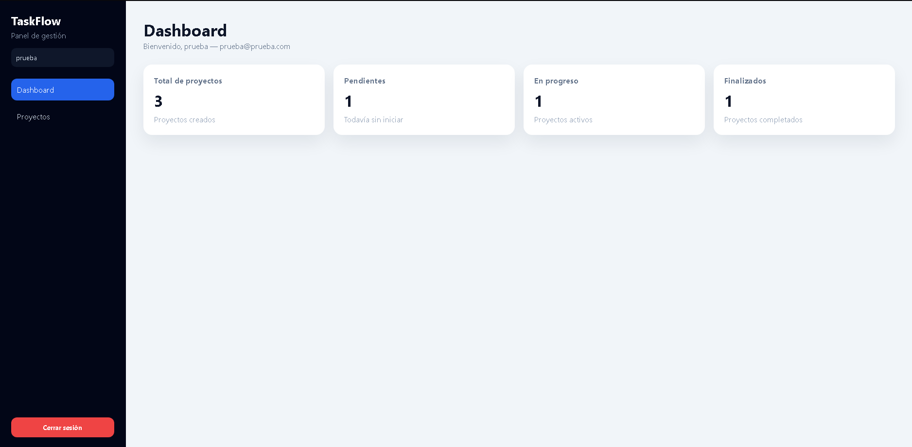
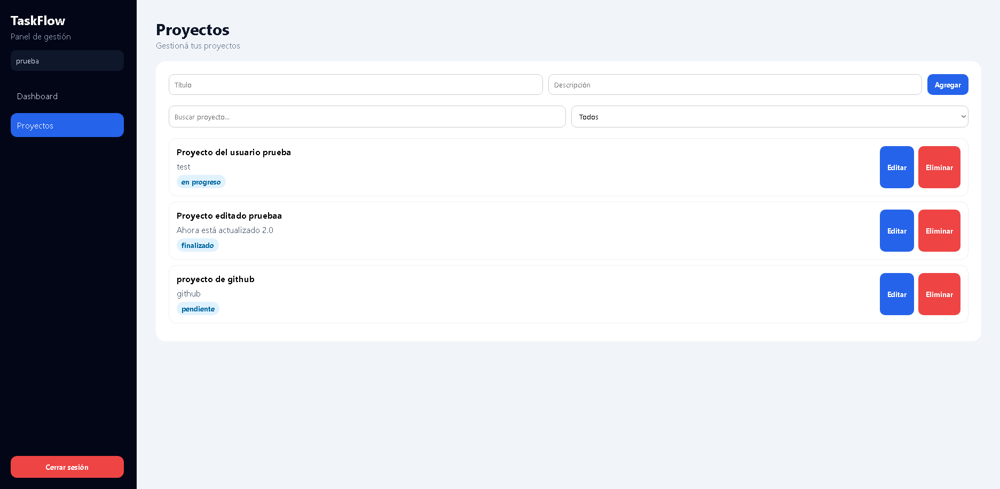

# TaskFlow Vue

Aplicacion full stack para gestionar proyectos con autenticacion, dashboard y CRUD completo.

## Demo

- Frontend: https://taskflow-vue-lucas.netlify.app
- Backend: https://backend-portafolio-r87v.onrender.com

## Vista previa




## Funcionalidades

- Registro e inicio de sesion
- Rutas protegidas
- Dashboard con estadisticas
- CRUD de proyectos
- Vista de detalle
- Manejo de sesion con token
- Soporte multiusuario

## Stack

### Frontend

- Vue 3
- Vue Router
- Axios
- CSS responsive

### Backend relacionado

- Node.js
- Express
- MongoDB Atlas
- JWT
- bcrypt

## Ejecutar en local

```bash
npm install
npm run dev
```

## Notas

- El frontend consume el backend desplegado en Render.
- Para deploy en Vercel o Netlify se incluye configuracion SPA.
